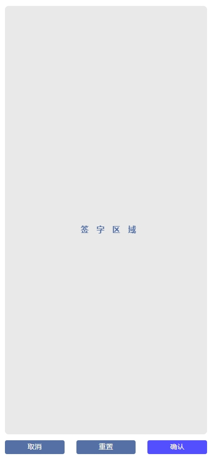
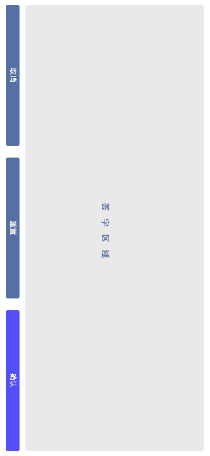

# @hsu-react/signature

[](https://www.npmjs.com/package/@hsu-react/signature)
[](./LICENSE)

React 手写签名板组件：全屏签字，支持横 / 竖屏，确认后导出签名图片（dataURL 与 Blob）。

## 效果




## 安装

```bash
npm install @hsu-react/signature
# 或
yarn add @hsu-react/signature
```

## 使用

```tsx
import React, { useState } from "react";
import Signature from "@hsu-react/signature";

const App: React.FC = () => {
  const [visible, setVisible] = useState(false);

  return (
    <Signature
      visible={visible}
      onConfirm={(src, blob) => {
        // src 为签名图片的 dataURL，blob 为对应的 Blob
        setVisible(false);
      }}
      onCancel={() => setVisible(false)}
    />
  );
};
```

## API

| 参数       | 说明                                                | 类型                                      | 默认值  |
| ---------- | --------------------------------------------------- | ----------------------------------------- | ------- |
| visible    | 是否显示签名板                                      | `boolean`                                 | `false` |
| horizontal | 是否横屏书写                                        | `boolean`                                 | `false` |
| onConfirm  | 点击确认的回调，返回签名图片的 dataURL 与 Blob      | `(src: string, blob: Blob \| null) => void` | -       |
| onCancel   | 点击取消的回调                                      | `() => void`                              | -       |

## 贡献

日常开发在 `develop` 分支进行（feature 分支合入 `develop`），`main` 只接受来自 `develop` 的 PR；合入 `main` 后按 `package.json` 版本自动打 tag 并发布 npm。PR 标题遵循 [Conventional Commits](https://www.conventionalcommits.org/)。

## License

[MIT](./LICENSE) © VitaHsu
